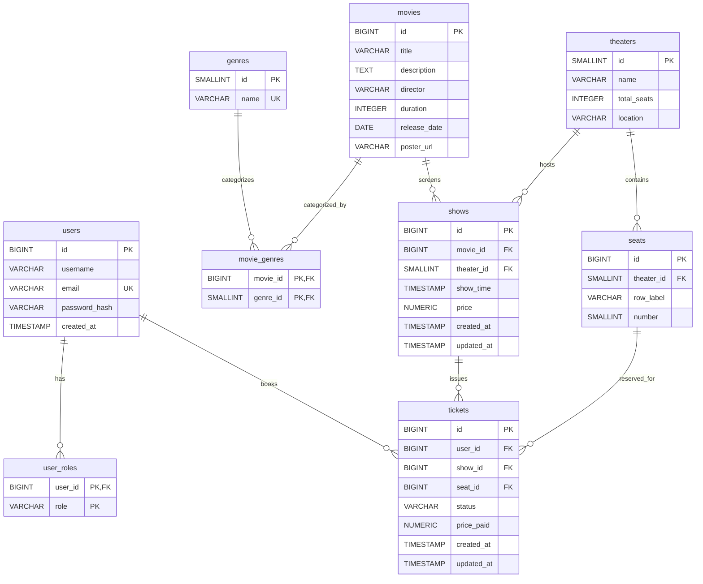

# Movie Reservation System

A Spring Boot web application for managing movie theaters, showtimes, seat reservations, and ticketing. It features role-based access control with JWT authentication, a PostgreSQL relational database (with Redis caching/locking), and a rich REST API for both admins and regular users.

---

## Table of Contents

- [Features](#features)  
- [Architecture](#architecture)  
- [Database Schema](#database-schema)  
- [ER Diagram](#er-diagram)  
- [Tech Stack](#tech-stack)  
- [Prerequisites](#prerequisites)  
- [Installation](#installation)  
  - [Using Maven (Local)](#using-maven-local)  
  - [Using Docker Compose (Containerized)](#using-docker-compose-containerized)  
- [Configuration](#configuration)  
- [API Endpoints](#api-endpoints)  
  - [Authentication](#authentication)  
  - [Movie Management](#movie-management)  
  - [Show Management](#show-management)  
  - [Reservations](#reservations)  
  - [Reporting](#reporting)  
- [Usage](#usage)  
- [License](#license)  

---

## Features

- **User Roles & Authentication**  
  - Admin and Regular User roles  
  - Secure JWT-based login  
  - Role-based endpoint protection  

- **Movie & Show Management**  
  - CRUD operations for movies, genres, theaters, shows, and seats (admins)  
  - Browse movies and upcoming shows (users)  

- **Seat Reservation**  
  - Select individual seats  
  - Prevent double-booking with pessimistic locking and Redis-backed distributed locks  
  - Unique constraint on (show, seat) to enforce one booking per seat  

- **Ticket Management**  
  - Book and cancel tickets  
  - Track ticket status (BOOKED, CANCELLED)  
  - Users can view and manage their own bookings  

- **Reporting & Analytics**  
  - Admin reports on reservations, capacity, and revenue  

- **Interactive API Docs**  
  - Swagger/OpenAPI UI for exploring and testing endpoints  

- **Error Handling**  
  - Global exception handler for consistent JSON error responses  

---

## Architecture

Layered design:

1. **Controllers** expose REST endpoints  
2. **Services** contain business logic and transaction management  
3. **Repositories** use Spring Data JPA for data access  
4. **Entities** map to database tables  
5. **DTOs & MapStruct** handle request/response payloads  

Concurrency control and data integrity are enforced via Redis locks, database constraints, and (optionally) optimistic locking.

---

## Database Schema

| Table            | Description                                                      |
|------------------|------------------------------------------------------------------|
| `users`          | Registered users (credentials, roles)                            |
| `user_roles`     | Roles assigned to users (e.g. USER, ADMIN)                       |
| `genres`         | Movie genres (Action, Drama, etc.)                               |
| `movies`         | Movie details (title, director, duration, release date, poster)  |
| `movie_genres`   | Join table linking movies and genres                             |
| `theaters`       | Auditorium halls (name, total seats, location)                   |
| `seats`          | Individual seats per theater (row label + number)                |
| `shows`          | Scheduled showtimes (movie, theater, time, price)                |
| `tickets`        | Booked tickets linking user, show, seat, status, and price paid  |

---

## ER Diagram



---

## Tech Stack

- **Java 17+ & Spring Boot 3.x**  
- **Spring Data JPA & Hibernate** (ORM for PostgreSQL)  
- **Spring Security & JWT** (stateless authentication)  
- **PostgreSQL** (relational database)  
- **Redis** (caching & distributed locking)  
- **Flyway** (DB migrations)  
- **springdoc-openapi (Swagger UI)** (interactive API docs)  
- **MapStruct** (DTO ↔ entity mapping)  
- **Lombok** (boilerplate reduction)  
- **Maven** (build & dependency management)  
- **Docker & Docker Compose** (containerization)

---

## Prerequisites

- **Java 17** or higher  
- **Maven 3.6+**  
- **Docker & Docker Compose** (optional, for containerized setup)

---

## Installation

### Local (Maven)

1. **Clone the repo**  
   ```bash
   git clone https://github.com/your-org/movie-reservation-system.git
   cd movie-reservation-system
   ```

2. **Start Postgres & Redis** (locally or via Docker):  
   ```bash
   docker run -d --name postgres -e POSTGRES_DB=moviedb      -e POSTGRES_USER=postgres -e POSTGRES_PASSWORD=example      -p 5432:5432 postgres:15-alpine

   docker run -d --name redis -p 6379:6379 redis:7-alpine
   ```

3. **Configure**  
   Edit `src/main/resources/application.yaml` to match your DB/Redis settings.

4. **Build & Run**  
   ```bash
   mvn clean install
   mvn spring-boot:run
   ```

### Containerized (Docker Compose)

1. **Build JAR**  
   ```bash
   mvn clean package -DskipTests
   ```

2. **Launch**  
   ```bash
   docker-compose up --build
   ```

The app will be available at <http://localhost:8080> and Swagger UI at <http://localhost:8080/swagger-ui.html>.

---

## Configuration

Edit the following in `application.yaml` or via environment variables:

```yaml
spring:
  datasource:
    url: jdbc:postgresql://postgres:5432/moviedb
    username: postgres
    password: example
  jpa:
    hibernate:
      ddl-auto: update
    show-sql: true
  redis:
    host: redis
    port: 6379

jwt:
  secret: your-secret-key
  expiration-ms: 3600000

springdoc:
  swagger-ui:
    path: /swagger-ui.html

server:
  port: 8080
```

---

## API Endpoints

All endpoints (except `/api/v1/auth/**`) require a valid JWT in the `Authorization: Bearer <token>` header.

### Authentication

| Method | Path                      | Description                 |
| ------ | ------------------------- | --------------------------- |
| POST   | `/api/v1/auth/register`   | Register a new user         |
| POST   | `/api/v1/auth/login`      | Authenticate and obtain JWT |

### Movies

| Method | Path                         | Role    | Description             |
| ------ | ---------------------------- | ------- | ----------------------- |
| GET    | `/api/v1/movies`             | Any     | List all movies         |
| GET    | `/api/v1/movies/{id}`        | Any     | Get movie details       |
| POST   | `/api/v1/movies`             | Admin   | Create a new movie      |
| PUT    | `/api/v1/movies/{id}`        | Admin   | Update an existing movie|
| DELETE | `/api/v1/movies/{id}`        | Admin   | Delete a movie          |

### Shows

| Method | Path                           | Role    | Description                     |
| ------ | ------------------------------ | ------- | ------------------------------- |
| GET    | `/api/v1/shows`                | Any     | List all shows                  |
| GET    | `/api/v1/shows/{id}`           | Any     | Get details for one show        |
| POST   | `/api/v1/shows`                | Admin   | Schedule a new show             |
| PUT    | `/api/v1/shows/{id}`           | Admin   | Update show details             |
| GET    | `/api/v1/shows/{id}/seats`     | Any     | Get seat availability for a show|

### Reservations

| Method | Path                                  | Role    | Description                        |
| ------ | ------------------------------------- | ------- | ---------------------------------- |
| POST   | `/api/v1/reservations`                | Any     | Book a ticket for a show           |
| PUT    | `/api/v1/reservations/{id}/cancel`    | Any     | Cancel an existing booking         |
| GET    | `/api/v1/reservations/me`             | User    | List my current bookings           |

### Reporting (Admin)

| Method | Path                               | Role    | Description                        |
| ------ | ---------------------------------- | ------- | ---------------------------------- |
| GET    | `/api/v1/reports/reservations`     | Admin   | Retrieve reservation reports       |

---

## Usage

1. **Register** or use existing credentials.  
2. **Login** (`/api/v1/auth/login`) to receive a JWT.  
3. **Authorize** in Swagger UI or your HTTP client:  
   ```
   Authorization: Bearer <your-token>
   ```  
4. **Explore** endpoints, book and cancel tickets, manage movies and shows.

---

## License

This project is licensed under the **MIT License**. See the [LICENSE](LICENSE) file for details.
