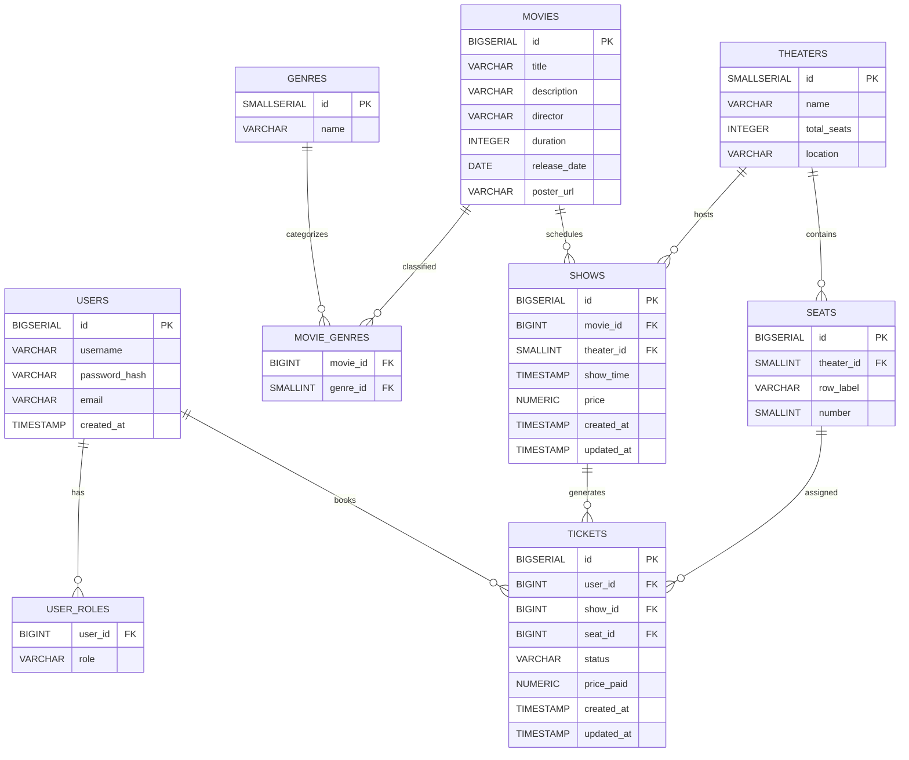

# Movie Reservation System

A Spring Boot application for managing movie theaters, shows, seat reservations, and ticketing with JWT security and PostgreSQL/Redis backend.

## Table of Contents

* [Features](#features)
* [Tech Stack](#tech-stack)
* [Prerequisites](#prerequisites)
* [Installation](#installation)
* [Configuration](#configuration)
* [Database Schema](#database-schema)
* [ER Diagram](#er-diagram)
* [API Endpoints](#api-endpoints)
* [Usage](#usage)
* [License](#license)

## Features

* User registration & role-based authentication (JWT)
* CRUD operations for genres, movies, theaters, shows, seats
* Bulk seat booking with pessimistic & Redis distributed locks
* Ticket management with status tracking and unique booking constraints
* Reporting and analytics

## Tech Stack

* Java 17 & Spring Boot
* Spring Security & JWT
* PostgreSQL
* Redis
* Docker & Docker Compose
* Maven
* Lombok & MapStruct

## Prerequisites

* Java 17+
* Maven 3.6+
* PostgreSQL 12+
* Redis
* Docker & Docker Compose (optional)

## Installation

1. Clone the repository:

   ```bash
   git clone https://github.com/<username>/movie-reservation-system.git
   cd movie-reservation-system
   ```
2. Configure database & redis in `src/main/resources/application.yml`.
3. Build the project:

   ```bash
   mvn clean install
   ```
4. Run the application:

   ```bash
   mvn spring-boot:run
   ```

## Configuration

Edit `src/main/resources/application.yml`:

```yaml
spring:
  datasource:
    url: jdbc:postgresql://localhost:5432/moviereservation
    username: your_db_user
    password: your_db_password
  redis:
    host: localhost
    port: 6379
  jpa:
    hibernate:
      ddl-auto: update
    show-sql: true
```

## Database Schema

The database schema includes the following tables:

| Table          | Description                                        |
| -------------- | -------------------------------------------------- |
| `users`        | Registered users                                   |
| `user_roles`   | Roles assigned to users                            |
| `genres`       | Movie genres                                       |
| `movies`       | Movie details                                      |
| `movie_genres` | Many-to-many relation between movies and genres    |
| `theaters`     | Theater halls                                      |
| `seats`        | Seats in each theater                              |
| `shows`        | Screenings of movies in theaters at specific times |
| `tickets`      | Booked tickets for shows with seat assignments     |

## ER Diagram



## API Endpoints

Refer to each controller for endpoints. Example:

* `POST /api/auth/register` – Register a new user
* `POST /api/auth/login` – Authenticate and retrieve JWT
* `GET /api/genres` – List all genres
* `POST /api/movies` – Create a new movie
* …

## Usage

Use tools like Postman or curl to interact with the REST API. Ensure JWT token is included in `Authorization` header: `Bearer <token>`.

## License

This project is licensed under the MIT License. See [LICENSE](LICENSE) for details.
